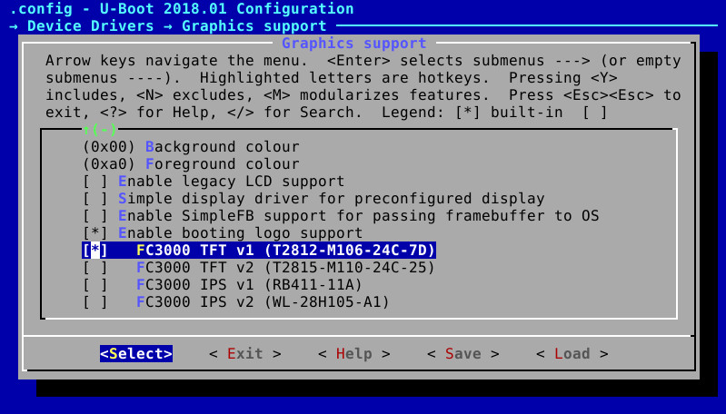
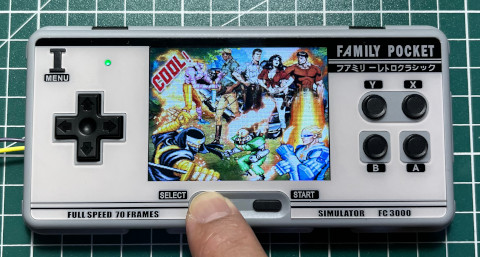
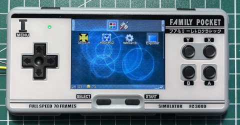

# U-Boot 2018.01 for FC3000 Handheld
## Description
The default serial port is UART0 (PE0, PE1) and default configuration file is configs/suniv_defconfig. It supports dual boot function now. You can boot into stock system by pressing SELECT button when power on. By default, it will boot into Linux OS.  
  
## Support LCD panel  
```console
FC3000 TFT v1 -> T2812-M106-24C-7D  
FC3000 TFT v2 -> T2815-M110-24C-25  
FC3000 IPS v1 -> RB411-11A  
FC3000 IPS v2 -> WL-28H105-A1  
```
  
## How to setup toolchain
```console
$ cd
$ wget https://github.com/steward-fu/miyoo/releases/download/v1.0/toolchain.7z
$ 7za x toolchain.7z
$ sudo mv miyoo /opt
```
  
## How to build and then flash into MicroSD
```console
$ ARCH=arm make suniv_defconfig
$ ./tools/make_suniv.sh /dev/sdX fc3000
```
  
## How to update booting logo
```console
$ ./tools/booting_logo xxx.jpg > drivers/video/booting_logo.h
$ ARCH=arm make menuconfig
```
Select correct LCD panel you want because each LCD panel has different initial code. 

  
## How to boot into stock system
Press SELECT and then power on  

  
## How to boot into Linux OS
Powe on without pressing SELECT  

